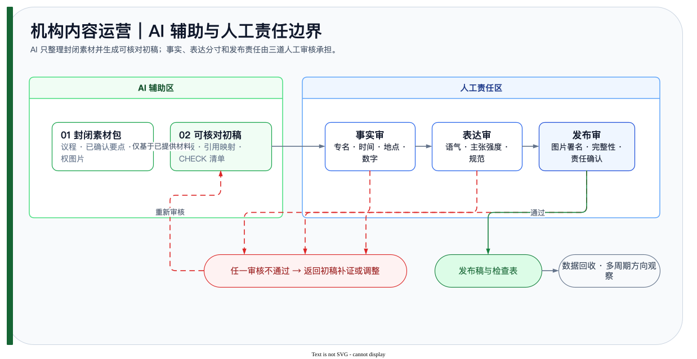

<a id="readme-top"></a>
<div align="right"><a href="#简体中文">简体中文</a> | <a href="#english">English</a></div>

<div align="center">
<h1>Institutional Content Ops</h1>
<p><em>Operational documentation and a preflight review guard for institutional content work.</em></p>


<p><a href="workflows.md">🧭 Operations</a> · <a href="skills.md">🧩 SOPs</a> · <a href="prompt-engineering.md">💬 Editorial prompts</a> · <a href="data-analysis.md">📊 Analysis</a></p>

</div>

<a id="简体中文"></a>

## 概览

本仓库记录会务筹备和机构内容生产的流程、SOP、Prompt、产品设计与分析材料。`src/content_guard.py` 在草稿进入人工审阅前检查未解决的核实标记、缺失的必需词和禁用词命中；它不发布内容，且不会批准发布。

## 仓库内容

| 内容 | 已有文件 |
|---|---|
| 筹备主线、任务台账与协作节奏 | [workflows.md](workflows.md) |
| 会务与内容生产 SOP | [skills.md](skills.md) |
| 公文/资讯初稿 Prompt 与编辑流程 | [prompt-engineering.md](prompt-engineering.md) |
| 内容架构与轮换式准实验材料 | [product-design.md](product-design.md) · [data-analysis.md](data-analysis.md) |
| 草稿预检参考 | [src/content_guard.py](src/content_guard.py) |

## 运行草稿预检

```bash
python3 src/content_guard.py --self-test
python3 src/content_guard.py
```

预检会识别 `[CHECK]` 或带标签的 `[CHECK: ...]` 标记、必需词缺失和禁用词；即使预检通过，输出也只表示可进入人工审阅，`release_approved` 始终为 `false`。

## 使用边界

- AI 可辅助整理结构和初稿，事实、语气、编辑和发布决定仍由人工负责。
- 不把预检结果视为事实核查、法律审核或发布批准。
- 使用机构自己的来源、审校流程和权限体系完成最终发布。

<a id="english"></a>

## Overview

This repository contains workflows, SOPs, prompts, product-design, and analysis material for meeting preparation and institutional content production. `src/content_guard.py` checks unresolved verification marks, required terms, and forbidden terms before human review. It does not publish content and never approves release.

## Contents

| Content | Existing file |
|---|---|
| Preparation flow, task ledger, and collaboration cadence | [workflows.md](workflows.md) |
| Meeting and content-production SOPs | [skills.md](skills.md) |
| Drafting prompts and editorial flow | [prompt-engineering.md](prompt-engineering.md) |
| Content architecture and rotating quasi-experiment material | [product-design.md](product-design.md) · [data-analysis.md](data-analysis.md) |
| Draft-preflight reference | [src/content_guard.py](src/content_guard.py) |

## Run Draft Preflight

```bash
python3 src/content_guard.py --self-test
python3 src/content_guard.py
```

The preflight detects `[CHECK]` and labelled `[CHECK: ...]` markers, missing required terms, and forbidden terms. Even when it passes, the result only permits human review: `release_approved` is always `false`.

## Scope

- AI may assist with structure and drafts; people remain responsible for facts, tone, editing, and release decisions.
- A passing preflight is not fact checking, legal review, or release approval.
- Final release must use the institution's own sources, review process, and permissions.
