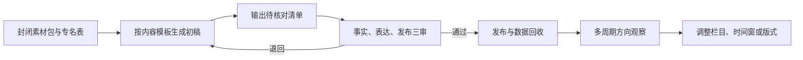

# 05 · 机构内容运营工作流

<p align="center">
  <a href="./workflows.md">协作工作流</a> ·
  <a href="./skills.md">执行 SOP</a> ·
  <a href="./prompt-engineering.md">内容 Prompt</a> ·
  <a href="./product-design.md">内容产品</a> ·
  <a href="./data-analysis.md">小样本复盘</a>
</p>
<p align="center"><code>封闭素材包</code> → <code>可核对初稿</code> → <code>人工三审</code> → <code>发布与数据回收</code></p>

> 面向高规范机构内容的受控生产方案：AI 只处理封闭素材，输出可核对初稿，再通过人工三审和小样本轮换实验持续优化。

| 解决的问题 | 适用场景 | 输入 | 输出 |
|---|---|---|---|
| 机构资讯与公文容错率低，AI 容易补写事实；单账号、小样本条件又不适合宣称随机 A/B 因果结果 | 机构公众号、行业资讯、会议报道、政策解读初稿、配套会务协作 | 封闭素材包、专名表、内容类型、发布规范、审核人、历史表现 | 带待核对项的初稿、三审记录、发布 SOP、栏目模板、轮换实验记录 |

## 何时使用

适合事实来源明确、必须逐项回查、发布前有人工审核的组织内容。若素材权属不清、缺少最终事实负责人或内容涉及未公开事项，不应交给 AI 扩写或发布。

> [!IMPORTANT]
> AI 只处理已提供的封闭素材。人物、机构、头衔、时间、地点、数字和政策表述缺失时必须输出 `[CHECK]`，不得自行补写背景。

## 快速启动

```yaml
content_type: 会议报道
source_pack: [议程, 已确认讲话要点, 公开背景资料, 授权图片]
term_sheet: [机构全称, 人员姓名与头衔, 固定政策表述]
claims_policy: 不提高原素材的主张强度
reviewers:
  facts: 事实负责人
  language: 编辑负责人
  release: 发布负责人
required_output: [初稿, 引用映射, CHECK清单, 图片署名, 发布检查表]
```

素材包、专名表和审核责任不完整时，任务应停在准备阶段。

## 使用路径



最短使用顺序：

1. 用 [product-design.md](./product-design.md) 选择读者、栏目和内容模板。
2. 按 [prompt-engineering.md](./prompt-engineering.md) 整理封闭素材包、专名表和禁写规则。
3. 生成初稿和待核对清单后，按 [skills.md](./skills.md) 执行人工三审与发布 SOP。
4. 将数据回收到 [data-analysis.md](./data-analysis.md) 的轮换记录中，只做多周期方向判断。
5. 会务或多工作线协作可采用 [workflows.md](./workflows.md) 的台账与待决策项机制。

## 可复用资产

| 资产 | 可直接复用的内容 |
|---|---|
| [协作工作流](./workflows.md) | 多线任务台账、依赖、风险和待决策项结构 |
| [执行 SOP](./skills.md) | 会务协作、内容生产、发布与数据回收检查 |
| [内容 Prompt](./prompt-engineering.md) | 封闭素材输入、专名回查、主张强度和待核对清单 |
| [内容产品设计](./product-design.md) | 读者画像、栏目、标题规范与 3 类模板 |
| [小样本复盘](./data-analysis.md) | 发布时间 × 图文结构的轮换式准实验 |

## 验证记录

公开版本保留真实工作中形成的流程和方法，但未提供产出耗时、差错率或账号增长的实际数字，因此不补写量化成果。验证落点包括：素材可追溯、专名逐项核对、三审留痕、发布后数据回收，以及多周期趋势是否一致。

## 验收要点

- 初稿中的人物、机构、时间、地点、数字和政策表述都能回到素材原文。
- AI 不自行补充背景；信息缺失时标记待核对，不做合理猜测。
- 事实审、表达审和发布审由人工完成并保留记录。
- 小样本结果只作为运营方向，不使用“显著提升”“最优方案”或因果结论。

## 边界

- 企业、机构、账号主体和协作单位均已匿名。
- 未提供实际量化数据的环节只说明逻辑与流程，不虚构成果。
- 内部筹备数量、节点、联系人和未公开信息不进入公开版本。

---

[查看 GitHub 账号中的其他独立项目](https://github.com/ChrysFu-FndVent?tab=repositories)
