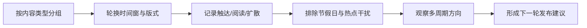

# 数据分析 · 公众号轮换式准实验

> 资产类型：小样本内容实验设计
> 适用边界：单账号、无法随机分流、内容不可重复发布；结果只用于方向性运营判断。

## 一、为什么不用标准随机 A/B

机构公众号存在三项现实约束：同一文章无法向读者随机展示不同版本；单篇阅读样本有限；不同文章的选题热度天然不同。因此本项目采用**轮换式准实验**，不把它包装成严格因果实验。

## 二、实验变量

### 发布时间

| 候选窗口 | 待验证假设 |
|---|---|
| 工作日早间 | 通知类内容可能更贴合工作信息处理节奏 |
| 工作日午间 | 较长内容可能获得更完整的阅读时间 |
| 工作日晚间 | 观点类内容可能更容易被转发与讨论 |

### 图文结构

| 版式 | 特征 | 待验证假设 |
|---|---|---|
| A：完整长图文 | 正文分节、信息在文内闭环 | 适合组织动态和完整叙事 |
| B：短导读 + 要点卡片 | 结论前置、便于扫读 | 适合信息密度较高的专业内容 |

## 三、轮换与记录方法

- 同类内容之间比较，避免拿通知公告与专家观点直接横比；
- 时间窗和版式交替出现，降低某一组合与特定选题绑定的影响；
- 记录节假日、重大热点、渠道转发等混淆因素；
- 不公开后台绝对数据，只保留方法、指标和判断边界。

## 四、指标体系

| 层 | 指标 | 用途 |
|---|---|---|
| 触达 | 打开率 | 判断标题与发布时间是否匹配读者节奏 |
| 消费 | 阅读完成、停留 | 判断结构是否利于理解 |
| 扩散 | 转发、在看 | 判断内容是否具有分享价值 |
| 服务 | 报名 / 下载等行动 | 判断通知类内容是否完成服务目标 |

不同内容使用不同主指标：通知看行动，技术交流看阅读，专家观点看扩散，不用单一阅读量评价全部内容。

## 五、结论如何使用

本项目不公开具体结果数字，也不宣称统计显著。实际复盘只形成三类输出：

1. **方向性观察**：某类内容在某个窗口或版式下多次表现同向；
2. **发布建议**：将方向稳定的组合写入排期检查单，同时保留复测；
3. **待验证项**：当结果受选题热度或外部事件影响时，不做确定结论。

## 六、可迁移方法

1. 没有随机分流时，可以做轮换观察，但必须降低结论强度；
2. 内容类型决定主指标，不能用流量媒体的单一指标评价机构号；
3. 实验输出不是“冠军版本”，而是下一轮可执行、可复查的运营建议。

## 七、数据质量与异常处理

每条观察记录同时保存内容类型、发布时间、版式、统计窗口、指标口径版本和已知混淆因素。遇到以下情况时，不进入跨周期比较：统计窗口不一致、后台口径变化、数据缺失未说明、重大热点或集中转发无法分离。

- 缺失值：保留为空并登记原因，不用 0 替代；
- 异常峰值：保留原始值，增加事件说明，不直接删除；
- 口径变化：创建新版本并停止与旧口径直接比较；
- 重复采集：以内容 ID、指标名和统计窗口作为去重键；
- 结论复核：至少两个可比周期同向才形成方向性建议，仍不表述为因果结论。
