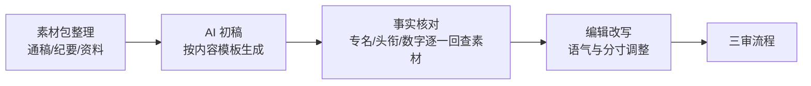

# Prompt 工程 · AI 辅助公文/资讯初稿的 Prompt 模板与编辑流程

> 资产类型：内容生产 Prompt 模板库
> 用途：科技社团公众号的内容有强规范性（机构名称、头衔、政策表述零容错）。本文沉淀"AI 出初稿 + 人工守规范"的协作流程与 Prompt 模板。

## 一、协作流程：AI 负责结构与速度，人负责事实与分寸



**核心纪律**：AI 只接触经人工整理的素材包，不允许 AI"自行补充背景"——公信力场景中，AI 幻觉出一个错误头衔的代价远大于省下的时间。

对无法从素材确认的事实统一保留显式标记：`[CHECK: 核对项｜责任人｜截止时间]`。标记必须由人工解决后删除，禁止通过改写或隐藏标记绕过预检。

## 二、三类内容模板对应的 Prompt（脱敏示例）

### 模板 A · 协会/分会动态（会议报道类）

```
根据以下素材撰写公众号动态稿初稿。

【素材包】会议纪要要点、出席人员名单（含核准头衔）、领导讲话要点
【结构】导语（时间地点事件一句话）→ 会议主要内容（2-3 段）→
       领导讲话要点（引语形式）→ 结尾（意义与下一步）
【硬性要求】
1. 人名、头衔、机构名只能使用素材包中的写法，一字不差；
2. 领导讲话只能改写素材中已有内容，禁止扩写或代拟观点；
3. 语体：新闻通稿体，庄重平实，不用感叹号，不用营销词；
4. 字数 800–1200。
【输出附加】文末列出"待人工核对清单"：你使用过的所有专名、
头衔、数字及其在素材包中的出处位置。
```

### 模板 B · 专家专业观点（约稿整理类）

```
将以下专家访谈/演讲速记整理为公众号观点文章初稿。
【硬性要求】
1. 只做结构化整理与口语转书面，不得增加速记中没有的观点；
2. 保留专家原有的判断强度（"可能""预计""一定"不可互换）；
3. 每个小标题下的内容必须能对应到速记的具体段落（标注行号）；
4. 开头注明"本文根据 XX 在 XX 场合的发言整理"。
```

### 模板 C · 行业技术交流（资讯编译类）

```
根据以下 2-3 篇公开报道素材，撰写行业资讯综述初稿。
【硬性要求】
1. 每个事实句标注来源编号 [1][2]，无来源的句子不允许出现；
2. 不同来源观点冲突时并列呈现，不做裁判；
3. 结尾"对会员单位的参考意义"一段留空，由编辑撰写
   （价值判断不交给 AI）。
```

## 三、模板设计的共性机制

| 机制 | 作用 | 与其他项目的呼应 |
|---|---|---|
| 素材包封闭输入 | 从源头杜绝幻觉背景信息 | 同受控配方系统的已审核功效表述白名单注入 |
| "待人工核对清单"输出 | 把校对从通读全文变为定点核查 | 同 used_claims / 标注出处机制 |
| 判断强度不可改变 | 守住专家表述的严谨性 | 同论文润色"主张强度不可改变" |
| 价值判断留白 | 敏感表述永远由人执笔 | 分寸感不外包给 AI |

初稿完成后运行 `src/content_guard.py`。预检只负责机械地发现未解决标记、必需词缺失和禁用词命中；它不能判断事实是否真实，也不能代替三审。策略文件应纳入版本管理，策略变化后旧的预检结果失效。

## 四、效果边界与可迁移方法论

- AI 初稿减少了从空白开始搭结构的工作，编辑精力更多转向事实核对与表达分寸；
- 公开版本不提供产出耗时和差错率数字；最终事实准确性来自素材回查与人工三审，而不是 AI 自身保证。

**可迁移结论**：在高规范性内容场景使用 AI 的公式 = **封闭素材输入 + 结构模板约束 + 可核对输出 + 人工终审**。该公式与[受控配方系统中的受控生成机制](https://github.com/ChrysFu-FndVent/constrained-formulation-agent/blob/main/prompt-engineering.md)采用相同原则。
