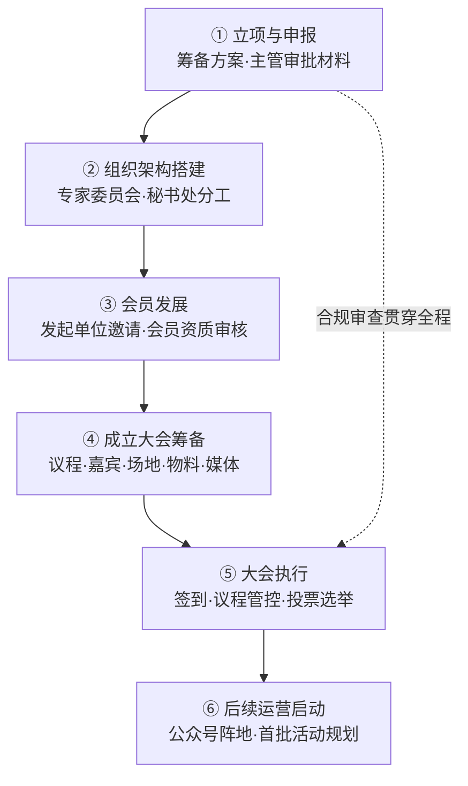

# Workflows · 相关筹备工作流与多线任务台账

> 资产类型：项目管理工作流
> 用途：新分会筹备是一个典型的"多方依赖、长周期、强合规"项目。本文沉淀筹备主线工作流与支撑它的动态任务台账方法。

## 一、筹备主线工作流

五条并行工作流在台账中分层管理：**申报审批线 / 专家邀请线 / 会员发展线 / 会务执行线 / 宣传阵地线**——瓶颈几乎都出现在跨线依赖处（如"大会议程"依赖"专家确认出席"依赖"邀请函审批"）。

## 二、多线任务动态台账（Excel）

### 台账字段设计

| 字段 | 用途 |
|---|---|
| 任务 ID / 所属工作线 | 分层归属，透视表按线切片 |
| 任务描述 / 责任人 / 协作方 | 单一责任人原则（协作方≠责任人） |
| 前置依赖任务 ID | 依赖显性化——跨线依赖是延误主因 |
| 计划完成日 / 实际状态 | 状态四值：未启动/进行中/已完成/受阻 |
| 风险等级（红黄绿） | 红=影响成立大会日期的任务 |
| 最近更新时间 / 备注 | 支撑固定节奏的滚动更新 |

### 固定节奏的滚动更新机制

1. **收集**：按工作线向责任人收口进展（模板化提问：状态变化？新增阻塞？需要谁协调？）；
2. **更新**：刷新状态与风险灯，受阻任务必须写明阻塞原因和所需决策；
3. **上报**：向秘书处输出一页纸摘要——本期完成 / 新增风险 / 待决策项三段式；
4. **预警**：距计划日 ≤7 天且未启动的任务自动进入预警清单（条件格式高亮）。

**关键经验**：台账的价值不在记录而在**暴露决策需求**——每次更新的核心产出是"待决策项清单"，让领导的时间花在拍板而不是听汇报上。

## 三、多方协作的节奏管理

| 相关方 | 协作特点 | 应对方式 |
|---|---|---|
| 主管部门 | 流程严谨、窗口期固定 | 材料预检清单、提前一个批次准备 |
| 院士/专家 | 日程稀缺、变动频繁 | 出席确认三次触达节奏（首邀/月前确认/周前再确认+备选嘉宾预案） |
| 会员单位 | 响应速度参差 | 分批邀请、标准资料包降低对方成本 |
| 供应商（场地/物料） | 商务节奏快 | 需求冻结日制度，冻结后变更走审批 |

## 四、可迁移方法论

1. **依赖显性化是长周期项目管理的核心**：延误从不发生在单个任务内部，而发生在没人认领的依赖交接处；
2. **固定节奏胜过无规则同步**：稳定的更新节奏让多线任务的信息更可控；
3. **汇报的终点是决策**：一页纸摘要中的"待决策项"可直接复用为产品周报框架（进展 / 风险 / 需要的支持）；
4. 这套台账方法后来也用于 网页采集 Agent 与文生应用 Agent 的需求池与迭代排期管理。
