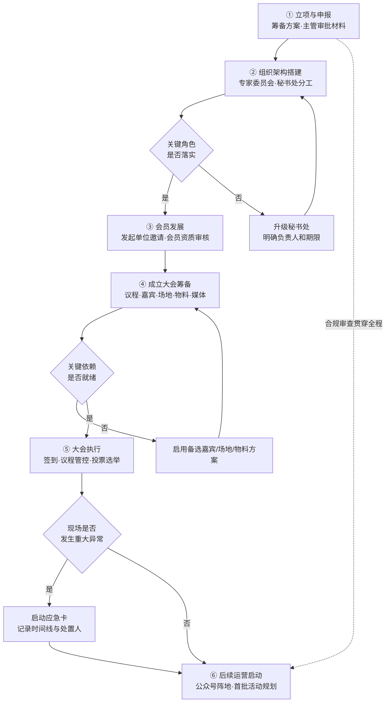
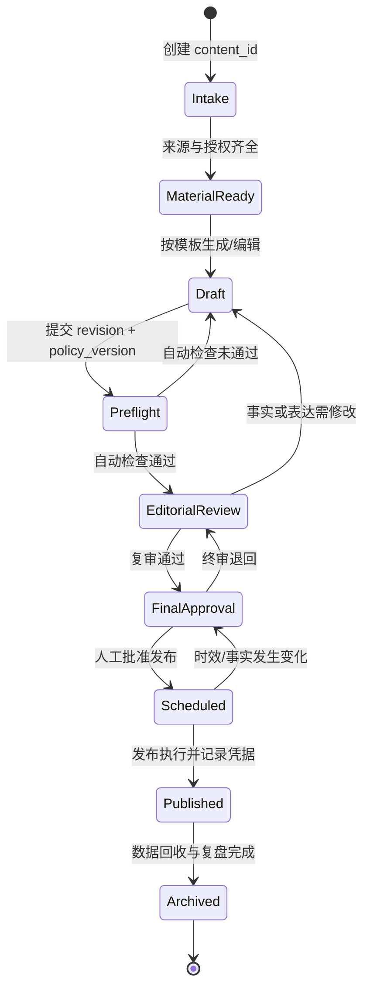

# Workflows · 相关筹备工作流与多线任务台账

> 资产类型：项目管理工作流
> 用途：新分会筹备是一个典型的"多方依赖、长周期、强合规"项目。本文沉淀筹备主线工作流与支撑它的动态任务台账方法。

## 一、筹备主线工作流

五条并行工作流在台账中分层管理：**申报审批线 / 专家邀请线 / 会员发展线 / 会务执行线 / 宣传阵地线**——瓶颈几乎都出现在跨线依赖处（如"大会议程"依赖"专家确认出席"依赖"邀请函审批"）。

## 二、多线任务动态台账（Excel）

### 台账字段设计

| 字段 | 用途 |
|---|---|
| 任务 ID / 所属工作线 | 分层归属，透视表按线切片 |
| 任务描述 / 责任人 / 协作方 | 单一责任人原则（协作方≠责任人） |
| 前置依赖任务 ID | 依赖显性化——跨线依赖是延误主因 |
| 计划完成日 / 实际状态 | 状态四值：未启动/进行中/已完成/受阻 |
| 风险等级（红黄绿） | 红=影响成立大会日期的任务 |
| 最近更新时间 / 备注 | 支撑固定节奏的滚动更新 |

### 固定节奏的滚动更新机制

1. **收集**：按工作线向责任人收口进展（模板化提问：状态变化？新增阻塞？需要谁协调？）；
2. **更新**：刷新状态与风险灯，受阻任务必须写明阻塞原因和所需决策；
3. **上报**：向秘书处输出一页纸摘要——本期完成 / 新增风险 / 待决策项三段式；
4. **预警**：距计划日 ≤7 天且未启动的任务自动进入预警清单（条件格式高亮）。

**关键经验**：台账的价值不在记录而在**暴露决策需求**——每次更新的核心产出是"待决策项清单"，让领导的时间花在拍板而不是听汇报上。

## 三、多方协作的节奏管理

| 相关方 | 协作特点 | 应对方式 |
|---|---|---|
| 主管部门 | 流程严谨、窗口期固定 | 材料预检清单、提前一个批次准备 |
| 院士/专家 | 日程稀缺、变动频繁 | 出席确认三次触达节奏（首邀/月前确认/周前再确认+备选嘉宾预案） |
| 会员单位 | 响应速度参差 | 分批邀请、标准资料包降低对方成本 |
| 供应商（场地/物料） | 商务节奏快 | 需求冻结日制度，冻结后变更走审批 |

## 四、可迁移方法论

1. **依赖显性化是长周期项目管理的核心**：延误从不发生在单个任务内部，而发生在没人认领的依赖交接处；
2. **固定节奏胜过无规则同步**：稳定的更新节奏让多线任务的信息更可控；
3. **汇报的终点是决策**：一页纸摘要中的"待决策项"可直接复用为产品周报框架（进展 / 风险 / 需要的支持）；
4. 这套台账方法后来也用于 网页采集 Agent 与文生应用 Agent 的需求池与迭代排期管理。

## 五、机构内容生产状态机

内容发布不是“写完即发”，而是一个带明确出口条件、失败回路和人工授权的状态机：

### 阶段数据契约

| 阶段 | 必需输入 | 出口条件 | 失败去向 |
|---|---|---|---|
| Intake | `content_id`、内容类型、责任人、计划日 | 责任人与时限唯一明确 | 缺字段则保持 Intake 并提醒责任人 |
| MaterialReady | 来源清单、授权状态、敏感信息分级 | 每项事实可回查，使用权限明确 | 退回素材收集；权限不明立即升级 |
| Draft | 模板类型、素材版本、编辑人 | 无自行补充事实，核对项使用 `[CHECK: ...]` 标记 | 回到编辑；禁止带未标记猜测进入检查 |
| Preflight | 草稿与策略；调用方持有修订号和策略版本 | `ready_for_human_review=true` | 输出问题清单；工具异常与内容不通过分开记录 |
| EditorialReview | 自动检查结果、来源映射、修改记录 | 自审与复审完成，事实/专名/数字已回查 | 退回 Draft，并递增 revision |
| FinalApproval | 定稿、发布时间、权限证明 | 有权负责人明确批准 | 退回复审；自动化永不替代该节点 |
| Scheduled | 批准记录、渠道、发布时间 | 发布前再次确认时效与事实未变化 | 失效则撤销排期并回到 FinalApproval |
| Published | 平台凭据、最终正文哈希、发布时间 | 发布结果可追踪 | 发布失败按运行手册重试或回滚 |
| Archived | 指标、异常、复盘结论 | 数据与证据按保留规则归档 | 缺失数据登记原因，不补造指标 |

### 最小审计字段

每次状态变化至少记录：`content_id`、`revision`、`from_state`、`to_state`、操作者、时间、`source_hash`、`policy_version`、原因和关联证据。相同 `content_id + revision + target_state` 的重复请求应视为幂等操作，避免网络重试造成重复发布或重复通知。`src/content_guard.py` 是无状态预检适配器，只返回检查结果，不负责状态持久化或审计信封；调用方应在写入台账/事件时附加这些元数据。`policy_version` 是调用方的审计字段，不是策略 JSON 的配置键，不应传给预检 CLI。

## 六、异常处理、重试与升级

| 异常类型 | 自动动作 | 重试上限 | 升级条件 | 人工处置 |
|---|---|---:|---|---|
| 输入缺失/格式错误 | 立即拒绝并返回可定位错误 | 0 | 关键字段影响当日节点 | 补齐输入后创建新 revision |
| 自动预检不通过 | 输出全部问题，不改变发布状态 | 0 | 同类问题连续出现 3 次 | 编辑负责人复盘模板或策略 |
| 自动预检工具异常 | 保留草稿与日志，禁止误判为通过 | 2 | 两次重试仍失败 | 转人工检查并登记降级原因 |
| 外部平台暂时失败 | 指数退避，复用幂等键 | 3 | 超过 15 分钟或临近时效窗口 | 决定延迟、换渠道或取消 |
| 来源事实变化 | 冻结排期并使原批准失效 | 0 | 涉及人物、数字、政策或法律表述 | 回到事实核对和终审 |
| 发布内容错误 | 保存证据并停止后续扩散动作 | 0 | 影响机构信誉、合规或个人权益 | 按运行手册撤回/更正并复盘 |

错误处理遵循两条规则：**失败关闭（fail closed）**——工具异常不能被当作内容通过；**区分内容问题与系统问题**——前者进入编辑回路，后者进入运维重试与降级回路。

## 七、可观测性与运营指标

不只记录“成功/失败”，还要观察流程是否健康：

- 流转效率：各阶段停留时长、按时完成率、受阻任务龄期；
- 内容质量：每轮核对项数量、退回原因分布、发布后更正次数；
- 系统可靠性：预检错误率、外部平台重试次数、重复请求拦截数；
- 审批完整性：缺失来源、授权或终审记录的次数必须为 0；
- 数据质量：指标缺失率、口径变更记录、异常数据的说明覆盖率。

详细故障分级、发布前检查和回滚步骤见 [运行手册](docs/operations-runbook.md)。
